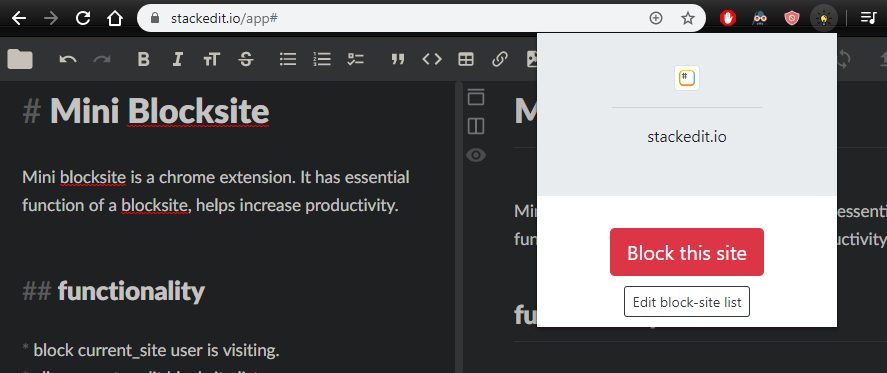

# Mini Blocksite 
Mini blocksite is a chrome extension. It has essential function of a blocksite, helps increase productivity.

## functionality
* add current_site to block-list.
* allow user to edit blocksite list.
* redirect user if they try to access no-go site.

## quick-start
* Open the Extension Management page by navigating to chrome://extensions
* Enable Developer Mode by clicking the toggle switch next to Developer mode
* Click the LOAD UNPACKED button and select the extension directory
* Like this:
  

## Demo

